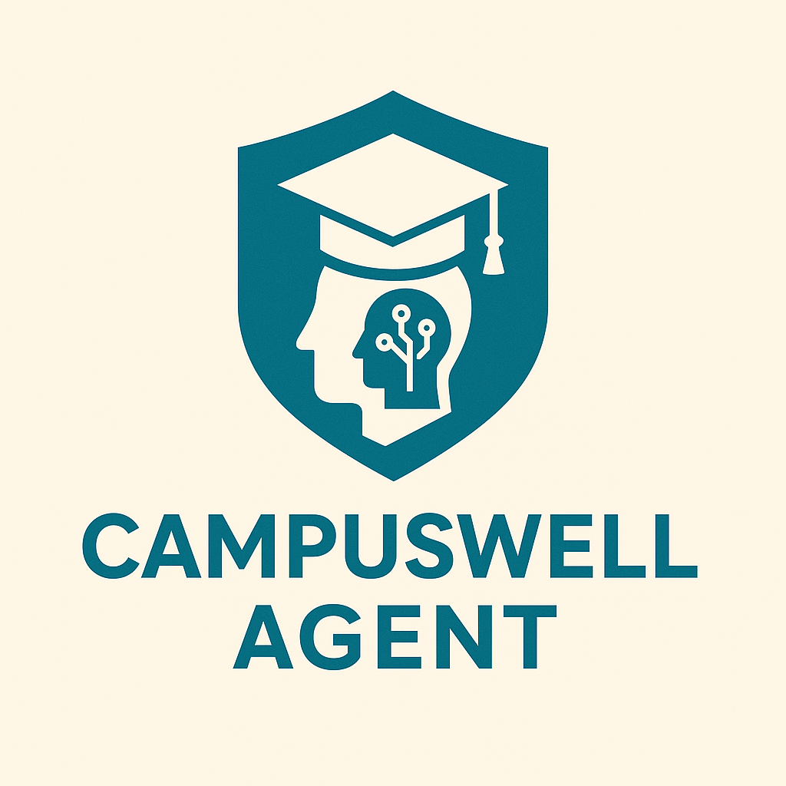

# CampusWell Agent

  

A multi-agent welfare assistant for college students, built with Google’s Agent Development Kit (ADK)

  
  
  
  
  

---

##  Hackathon Project

This project was developed as part of the **Kaggle × Google Agents Intensive Capstone**, focusing on building real-world multi-agent systems using Google’s Agent Development Kit (ADK).

The objective was to design a unified AI assistant capable of coordinating multiple specialized agents to support students across academic, personal, and administrative domains.

---

##  Project Overview

CampusWell Agent is a multi-agent system designed to improve the academic and personal well-being of college students.

It brings together specialized agents that:

- streamline academic planning  
- reduce stress and improve wellness  
- guide financial decisions  
- simplify navigation of campus resources  

The system demonstrates practical multi-agent coordination, validation-driven workflows, and context-aware decision-making.

---

##  Problem Statement

College students face a wide range of challenges:

- Overwhelming academic workload  
- Difficulty managing schedules and deadlines  
- Limited clarity on financial processes (fees, scholarships, forms)  
- Stress, burnout, and lack of structured wellness practices  
- Difficulty navigating campus resources (labs, libraries, counseling, placements)  

Most institutions lack a unified assistant to manage academics, wellness, and administrative needs in one place—leading to inefficiency and increased stress.

---

##  Solution

CampusWell Agent provides a centralized AI assistant that supports students across multiple domains through coordinated agents.

It enables:

- Personalized study schedules  
- Structured task planning  
- Wellness and stress management guidance  
- Campus resource discovery  
- Financial process assistance  
- Automated email/message drafting  

All handled through a collaborative ecosystem of agents for reliability and clarity.

---

##  System Architecture

At the core is the **CampusLife Orchestrator**, responsible for:

- managing session state  
- maintaining long-term memory (MemoryBank)  
- coordinating agent workflows  
- handling context propagation  
- enabling observability and logging  

---

##  Agents Overview

### 1. Academic Planner Agent
- Generates study schedules  
- Breaks tasks into smaller steps  
- Validates plans using ScheduleValidationChecker  
- Uses loop-based retries for optimal output  

---

### 2. Mental Wellbeing Agent
- Provides stress management techniques  
- Suggests break routines  
- Tracks patterns for personalized recommendations  

---

### 3. Financial Guidance Agent
- Explains fees, scholarships, and deadlines  
- Provides structured financial guidance  
- Uses custom lookup tools  

---

### 4. Campus Resource Navigator
- Locates campus facilities and services  
- Provides quick access to essential information  
- Uses structured datasets and search tools  

---

### 5. Message Writer Agent
- Generates formal emails and requests  
- Drafts academic and administrative communication  
- Assists in resume and message creation  

---

## 🛠️ Tools & Utilities

- **Schedule Generator Tool**  
  Creates structured and conflict-free study plans  

- **Campus Info Lookup Tool**  
  Retrieves campus-related data  

- **Student Profile Memory Tool**  
  Stores long-term user context:
  - courses  
  - preferences  
  - stress patterns  
  - goals  

- **Validation Checkers**  
  - ScheduleValidationChecker  
  - RoutineValidationChecker  

These ensure output quality through validation loops.

---

##  Features

- Multi-agent system with coordinated workflows  
- Loop-based validation and retry mechanisms  
- Custom tool integration  
- Long-term memory (MemoryBank)  
- Context-aware reasoning  
- Observability (logs, tracing, metrics stubs)  
- Modular and scalable architecture  

---

##  How to Run

### 1. Install dependencies
bash
pip install -r requirements.txt

---

## License

This project is released under the MIT License.
Feel free to use, modify, and extend it.

---
 Acknowledgments

Special thanks to the Google ADK team, Kaggle, and the community examples which inspired this project’s architecture and modular organization.

